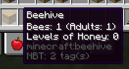

# Beehive Tooltips

## What is it?

This Fabric and Forge mod lets you see the honey level and bee contents of a beehive.

More information on the [mod page](https://www.curseforge.com/minecraft/mc-mods/beehivetooltips)
